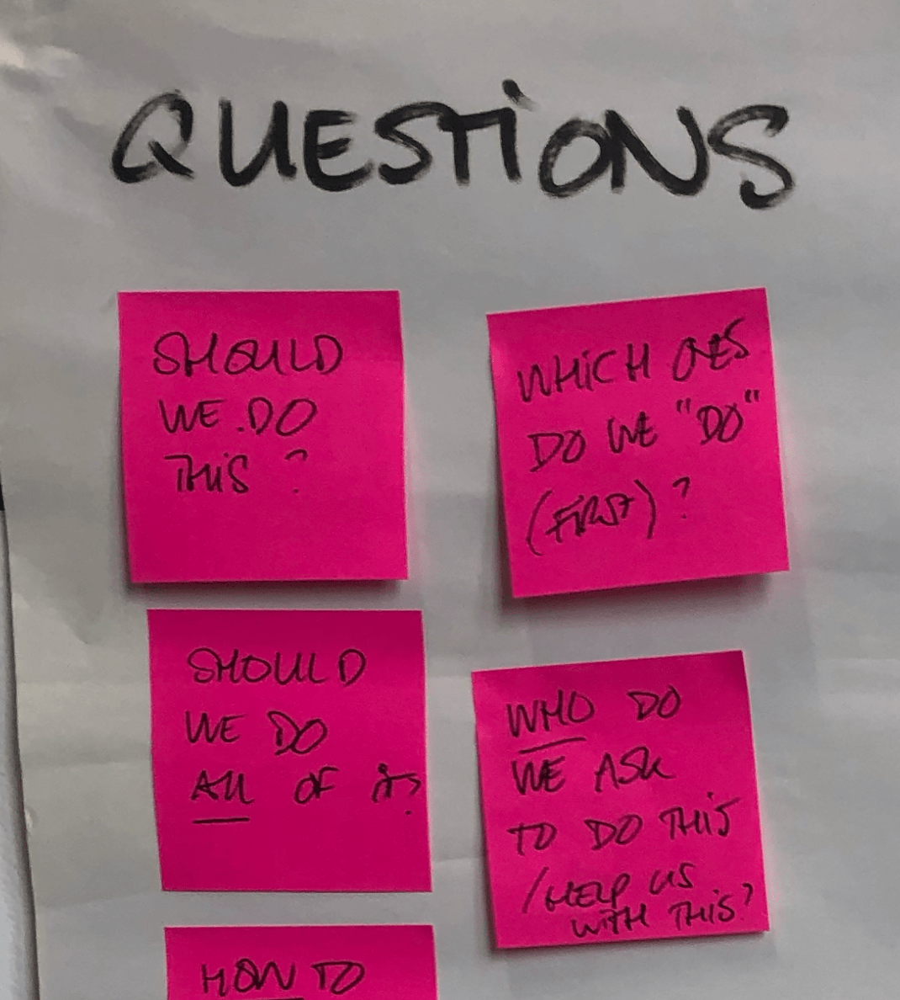
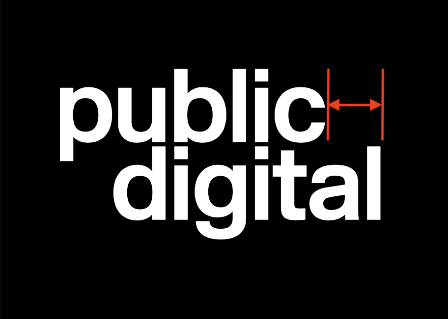

## Introduction

**August 2019**

The *Blue Team* launched a new feature for the *CRM* (Customer Relationship Management) software used by ~5k people at the DIT.

This feature let our users cc an email bot in calendar invites for meetings. The bot would *parse* the calendar invite, automatically create an interaction record for it in the CRM and send a link to the relevant people.

The project came about from a discovery that pointed out that our users wanted more SalesForce-like features in the CRM - for example, better email integration.

We built the thing in ~4 months - dotting all the Is and crossed all the Ts -

- **We were Agile** - Backlog, Trello board, 2-week-sprints, planning at the start, demo and retro at the end, etc.
- **We cared about our users** - The project was preceded by a couple of months of meticulous user research, the journeys were painstakingly mapped out, every detail covered, every copy reviewed.
- **We followed good engineering practices** - sound architecture, great code quality, near-perfect test coverage, etc.
- **We delivered -** The brief was to build the email bot, we delivered a working email bot, according to the specs, on time.

Yes, there was clapping & congratulatory emails but this picture is from the internet

Over the course of the next few months, we discovered that our thing was used by **exactly 5 users**.

<aside>
🔥 We did an excellent job of buiding something that no one needed

</aside>

I joined the Blue Team at DIT in June 2019. Before that, I had worked 15 years at startups. Many of which also did an excellent job at building something that no one needed. Some of them didn't live to tell the tale.

In the aftermath of the email bot project, I discovered 2 things -

1. The Blue Team was receptive to ideas on building things that users need & they provided me with a safe space to share my (startup) experience with them.
2. The senior management was happy to let the team take responsibility for delivering **outcomes instead of solutions**.

## Outcomes over solutions

Company records in our CRM were a mess. In order to fix them, DIT bought access to the [D&B](https://www.dnb.co.uk) - A database of validated, global company data. The idea was to replace the company records in our CRM with those from D&B. This had several benefits - the primary one being that D&B kept their company records up to date (unlike our users).

Over the course of the next few months, we rolled-out several work-packages to integrate D&B with our CRM -

1. We built a **New add-a-company journey** that let our users search for D&B companies and pull them into the CRM instead of having to type e.g. company addresses and telephone numbers into forms.
2. We were able to migrate about a quarter of existing company records in our CRM to D&B by writing scripts that **automatically matched company records in our CRM to D&B.**
3. We designed the journey to **get our users to match the remaining company records to corresponding D&B records.**

In each of these work-packages, we progressively developed a way of working that mitigated the risk of not building things that users need.

By the time we reached the last bit, we had consensus on certain guiding principles -

## 1/ The Needle

Every project needs a *north star* so that the team can correct course periodically. A metric that objectively proxies intended outcomes is a good north star.

For example - for the D&B integration project we agreed on the following -

<aside>
🔥 50% companies "looked-at" in our CRM would be matched to D&B

</aside>

We called it **the needle** - as in - 'we want to move the needle for our users'.

We were 100% transparent about the needle and its motion. We put the needle on a dashboard. We put this dashboard on a big screen. We put the big screen in the center of our workspace.

Knowing what success looks like, encoding it in a metric, and putting the metric on a dashboard is *nice* for any project. But, if you want to build things that users need, it is *critical*.

## 2/ Hypotheses

For each iteration of our project, we put down a list of **hypotheses** that might move the needle.

For example - for the final work-package i.e. getting our users to match company records to D&B, we listed the following -

- **Carrot** - If we tell our users the benefits of matching company records to D&B, our users will match company records to D&B
- **Stick -** If we tell our users that the company records that are not matched to D&B will be archived, our users will match company records to D&B

We were open to all ideas  😅

The vocabulary for this is important. *Hypothesis* underlines the fact that we have finite confidence in the success of any of these propositions.

## 3/ Experiments

Armed with a list of hypotheses, the team would come up with *cheap* experiments to validate them.

Again, vocabulary is important. *Experiment* underlines the fact that the outcome is *learning*. Learning about the product, about the market, about our users.

---

**A side-note -** The hypotheses-experiment thing has an interesting side-effect. Learning about the product, and about users is no longer an exclusive function of product managers and user researchers respectively. I feel it is important for x-functioning teams to not degenerate into What & How functions in order to avoid problems like the following -

---

The experiments were a lot of fun and it was where a lot of the magic happened. More on this later.

# 4/ Pivot

At the end of each iteration, we would gather around the needle and ask ourselves a single question -

> What did we learn?
>

If a hypothesis was validated by our experiments, we would continue down that path.

If a hypothesis didn't hold up to experimentation, we would try something else.

Try something else meant coming up with a new list of hypotheses; Naturally - informed by what we have already learned. Try-something-else is also called a *pivot*.

## Summary

To sum it all up -

- Figure out the **needle** (Measure)
- Generate **hypotheses** - ideas on how to move the needle (Learn)
- Design **experiments** to validate hypotheses (Build)

Also known as - **build-measure-learn** loop. Except - you don't do it in that order the first time 😊

## An Example

**Getting our users to match comapny records to D&B**

### 1/ The Needle

50% companies "looked-at" in our CRM would be matched to D&B

### 2/ Hypotheses

We decided to start with the carrot i.e. If we tell our users the benefits of matching company records to D&B, our users will match company records to D&B.

### 3/ Experiment

Surely, the only way to test our hypothesis was to build the matching system? The problem with this was that matching company records to D&B had 100s of corner cases. For example -

- Companies can have branches
- Some companies are registered locally in different countries
- Companies dissolve
- Companies have mergers

Building software that **just worked** ™️  for all (or even most) of these corner cases would take too long. It would not be cheap. It would also not be an experiment.

Remeber this?

Constraints. Drive. Creativity.

In one of our sessions, the team came up with a clever hack that would allow us to test the hypothesis without spending 6 months not building things that users need.

Here is how it worked -

**Call to action**

We would put the following message at the top of the page for company records that were not matched to D&B records -

**Matching**

We had already built the following for our **new add-a-company journey**. We repurposed it for the matching -

**The Flintstones Car**

As soon as a user found a match for a company, a small function was triggered in our *Frontend* code. This function sent an email to ZenDesk, creating a ticket that said -

> A user wants to match X company record with Y D&B record
>

To the user, we said - "We will get back to you" -

That's it. No companies were actually matched. No records updated. Not yet.

At the end of the workday, our product manager would go through the list of tickets, double-check if they made sense, and completed the matching process **manually.** He also took note of any corner cases and discussed them with the team.

In startup terms, this is called - **doing-things-that-don't-scale**.

From our users' perspective, it looked and felt like we had built the matching thing in a couple of weeks. In fact, we built this -

**Like a proper car -**

- A *Flintstones car* looks like a car (at least from a distance)
- A *Flintstones car* can also take you to places you want to be (albeit at walking pace)

**Unlike a proper car -**

- The *Flitstones car* took a a couple of weeks to build and cost 100x less
- The *Flintstones car* validated that a car is indeed what users needed
- If the *Flintstones car* failed, we had 2 weeks less than the total time for the project to try other things

The last point is super-important. You can generally bet on good x-functioning teams to *eventually* find the product-market fit. But often, this doesn't happen on the first try.

If your project plan is set up to release exactly **one** perfect version of whatever it is you are building, it's like buying a lottery ticket.

## Some notes

There are several associated points here that I would like to make but they would make this essay too long -

- The relationship between building things that users need & agile is similar to the relationship between strategy and tactics respectively.
- Proper x-functioning teams are necessary for building things that users need. Proper x-functioning teams are not split into (1) What & (2) How functions. Proper x-functioning teams have specialists and not gatekeepers.
- It is surprisingly easy to sell this to senior management. They are generally quite happy with teams taking responsibility to deliver outcomes instead of features.
- The Flintstones car is also known as - an 💥  *MVP*  (Minimum Viable Product). If we had built shitty half-ass software for matching companies that broke on every corner case, it would not be an MVP, it would be a prototype. Shared vocabulary - slashing the cost for communicating ideas by ~100x for centuries.
- There are dozens of [known MVP patterns](https://www.robotmascot.co.uk/18-types-of-minimum-viable-product/) in addition to the Flintstones car.
- The following is a poor (but PowerPoint-friendly & therefore popular) illustration of what an MVP means. If you really want to build the MVP for a car, see how Tesla did it.

    

- The Flintstones car **tested poorly**™️  in user research. While it was producing insane metrics. This is a different article that I might write another time but tl;dr Random sampling from what is essentially a long-tail distribution is as mad for user research cohorts as it is for stock portfolios.
- The engineering for building things that users want is very different to regular engineering. This is also true to a lesser degree for product management.

## Sources

Nothing I have described in this document is novel or ground breaking.

In fact, I have been dancing around terms like MVP (Minimum Viable Product) because I realize that they been overloaded to an extent that it doesn't mean anything anymore. This is most unfortunate but a topic for another discussion (or a rant) at another time.

The Lean Startup introduced us to - minimum viable products, build-measure-learn, and pivots and laid out a reproducible method to build products that users need.

The Startup Way translated these principles to established enterprises and introduced embedded startups.

All we did was to -

- take what has been shown to work elsewhere (primarily startups)
- convince the stakeholders to adopt some of it
- in a large public sector organisation here in the UK
- have good results to show for it

The Flintstones car became a thing at DIT. We did versions of it in several other projects. Other teams did the same.

## Hello 👋

I am Ali and I have built dozens of products in this way at some exciting (& successful) startups in the UK and elsewhere.

Some of these products are still in production and used by millions of people. I am doing it again with [dripl.co.uk](http://dripl.co.uk) and I am [building it in public](https://www.notion.so/How-to-Unstartup-4f4ea12d2c8b4e97be3fce5667a08d17).

I generally do not care for job titles but when pushed, I like to say that I am a **Product Engineer**. A product engineer is someone who -

- Understands products better than most engineers
- Understands engineering better than most product managers

(Most technical co-founders and CTOs [in internet-era startups](https://public.digital/2018/10/05/why-hire-an-internet-era-cto-what-will-they-actually-do) are product engineers)

I joined [public.digital](http://public.digital) in August last year. I believe that there is a better, reproducible, scientific way of building things that users need. It is about time the public sector catches up to this.

